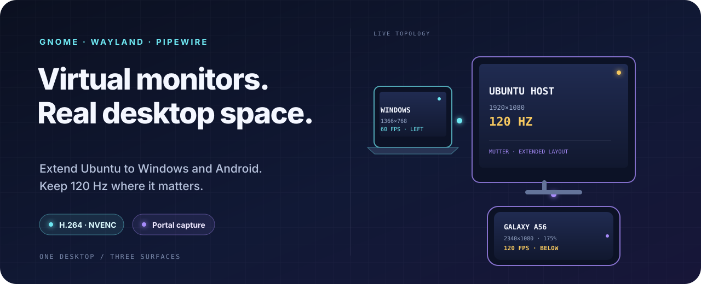
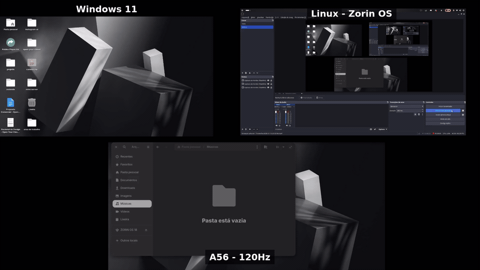

<p align="center">
  
</p>

<p align="center">
  <a href="#en"><b>English</b></a> · <a href="#pt">Português</a>
</p>

<a id="en"></a>

<h1 align="center">GNOME Wayland virtual monitors for Sunshine</h1>

<p align="center">
  Turn a Windows laptop and an Android phone into real extended displays.<br>
  One GNOME desktop, independent streams, mixed refresh rates.
</p>

<p align="center">
  <a href="https://github.com/lirenzzzin/gnome-wayland-virtual-monitors-sunshine/actions/workflows/ci.yml"></a>
  
  
  <a href="LICENSE"></a>
</p>

<p align="center">
  
</p>

> [!WARNING]
> This is an experimental GNOME/Mutter integration, validated on one GNOME 46 + NVIDIA system. It uses private D-Bus interfaces and isolated Sunshine processes. Read the [known sharp edges](#known-sharp-edges) before installing.

## What you get

| Real extension | One stream per device | Refresh stays independent |
| --- | --- | --- |
| Windows move naturally beyond the edge of the physical display. Nothing is mirrored. | Separate Sunshine identities capture the laptop and phone outputs at the same time. | The main display and phone run at 120 Hz while the laptop remains at 60 Hz. |

The validated desktop looks like this:

| Surface | Mode | GNOME placement | Client path |
| --- | ---: | --- | --- |
| Physical primary | **1920×1080 · 120 Hz** | center | local |
| Windows laptop | **1366×768 · 60 Hz** | left | Sunshine → Moonlight |
| Galaxy A56 | **2340×1080 · 120 Hz · ~175%** | centered below | Sunshine → Moonlight Android |

Under the hood, a user daemon asks Mutter for `RecordVirtual` outputs, keeps their PipeWire nodes alive, and applies the extended layout. Sunshine captures each output through its own XDG Portal session.

## Quick start

### 1. Install the host dependencies

```bash
sudo apt update
sudo apt install \
  python3-gi \
  gir1.2-gstreamer-1.0 \
  gstreamer1.0-pipewire \
  gstreamer1.0-tools \
  pipewire-bin
```

Install [Sunshine](https://docs.lizardbyte.dev/projects/sunshine/latest/md_docs_2getting__started.html) on Ubuntu and [Moonlight](https://moonlight-stream.org/) on each client. The supplied service files expect native Sunshine at `/usr/bin/sunshine`.

### 2. Clone and inspect the host

```bash
git clone https://github.com/lirenzzzin/gnome-wayland-virtual-monitors-sunshine.git
cd gnome-wayland-virtual-monitors-sunshine
./scripts/doctor.sh
```

A fractional-scaling warning is expected before installation; the installer can enable the required Mutter feature.

### 3. Install the user service

```bash
./scripts/install-user.sh
${EDITOR:-nano} ~/.config/gnome-virtual-monitors/config.toml
PYTHONPATH="$HOME/.local/lib/gnome-wayland-virtual-monitors-sunshine" \
  python3 -m gnome_virtual_monitors \
  --config "$HOME/.config/gnome-virtual-monitors/config.toml" \
  --check-config
systemctl --user enable --now gnome-virtual-monitor.service
```

Before enabling the service:

- set the physical connector, width, height, and refresh for your primary display;
- give every virtual monitor a unique width/height pair; and
- remember that v0.1 manages one physical primary plus the configured virtual outputs.

The installer stays inside your home directory. It does not start a root daemon, replace a kernel module, overwrite an existing monitor config, or erase unrelated Mutter features during rollback.

### 4. Connect the clients

Keep the normal Sunshine instance for the Windows laptop. Install the isolated Android instance from `experimental/`, select the wide phone output in GNOME's Portal dialog, then add `HOST_IP:48049` in Moonlight Android.

For the Galaxy A56:

- enable **Display → Motion smoothness → Adaptive**;
- choose **2340×1080 at 120 FPS** in Moonlight;
- start around **28 Mbps**, H.264, lowest-latency frame pacing; and
- use touchscreen-as-trackpad for the non-primary output.

The full pairing, Portal, port, H.264/NVENC, MediaCodec, Windows, and Android walkthrough is in [Sunshine and Moonlight setup](docs/SUNSHINE.md).

## One button to avoid

> [!CAUTION]
> Do not click **Stop Sharing** in GNOME's monitor-with-arrow status indicator while the virtual displays are active. GNOME includes the daemon's virtual-output sessions there; stopping them destroys the outputs and may stale Sunshine's Portal tokens.

If it happens, stop both Sunshine instances, restart the virtual-monitor daemon, wait for `Display layout applied`, then restart and reauthorize only the instances that fail. The exact recovery commands are in [Troubleshooting](docs/TROUBLESHOOTING.md).

## Known sharp edges

- GNOME/Mutter only — this is not a compositor-independent Wayland protocol.
- Mutter 46 can corrupt the embedded cursor around 175% screencast scaling. The documented fallback keeps the UI size while trading some sharpness.
- XWayland applications may look softer under fractional scaling.
- `Meta-0` and `Meta-1` are temporary names; the daemon maps roles by unique resolution instead.
- Recreating virtual outputs can invalidate saved Portal selections.
- Two Sunshine processes isolate capture and state, not keyboard/pointer ownership.
- Suspend/resume and newer GNOME versions still need wider testing.

## Documentation

| Guide | Use it when… |
| --- | --- |
| [Project scope](docs/PROJECT_SCOPE.md) | you want the exact promises and non-goals |
| [Architecture](docs/ARCHITECTURE.md) | you want to understand Mutter, PipeWire, layout, and readiness |
| [Sunshine + Moonlight](docs/SUNSHINE.md) | you are pairing Windows or Android and tuning 60/120 FPS |
| [Troubleshooting](docs/TROUBLESHOOTING.md) | Portal, cursor, output selection, or FPS behaves incorrectly |
| [Testing](docs/TESTING.md) | you are validating a new machine or GNOME release |
| [Rollback](docs/ROLLBACK.md) | you want to remove the daemon without deleting client state |
| [Security](SECURITY.md) | you are reviewing tokens, ports, encryption, or input trust |
| [Prior art](PRIOR_ART.md) | you want the upstream work this integration builds upon |

<details>
<summary><strong>Validated stack</strong></summary>

- Zorin OS 18, based on Ubuntu 24.04
- GNOME Shell and Mutter 46.2 on Wayland
- NVIDIA GTX 1650, proprietary driver 595.71.05
- Sunshine 2026.516.143833 with XDG Portal capture
- PipeWire 1.0.5 and GStreamer `pipewiresrc`
- Windows laptop at 1366×768, 60 Hz
- Galaxy A56 landscape at 2340×1080, 120 Hz, approximately 175% GNOME scale
- Moonlight Android with H.264 hardware decoding

</details>

## AI-friendly

Reading this with an assistant? Point any model — ChatGPT, Claude, Gemini,
Copilot, or a local one — at [`docs/ai/context.md`](docs/ai/context.md) so it
recognizes the architecture, the validated stack, and the sharp edges before
it suggests changes. Ready-to-use prompts live in
[`docs/ai/prompts.md`](docs/ai/prompts.md), and [`AGENTS.md`](AGENTS.md) is the
shared entrypoint. The context is public, tied to no account, and grants no
automated permissions — it is just shared understanding for whichever
assistant you happen to use.

## Credit

Created and maintained by **Lina**. Licensed under [GPL-3.0-or-later](LICENSE).

This project is independent and is not affiliated with GNOME, Sunshine, LizardByte, Moonlight, NVIDIA, Microsoft, or Samsung.

<br>

---

<a id="pt"></a>

<p align="center">
  <a href="#en">English</a> · <b>Português</b>
</p>

<h1 align="center">Monitores virtuais GNOME Wayland para o Sunshine</h1>

<p align="center">
  Transforme um notebook Windows e um celular Android em telas estendidas de verdade.<br>
  Um único desktop GNOME, streams independentes, taxas de atualização mistas.
</p>

<p align="center">
  
</p>

> [!WARNING]
> Esta é uma integração experimental com o GNOME/Mutter, validada em um único sistema GNOME 46 + NVIDIA. Usa interfaces D-Bus privadas e processos Sunshine isolados. Leia as [arestas conhecidas](#arestas-conhecidas) antes de instalar.

## O que você ganha

| Extensão real | Um stream por dispositivo | Refresh independente |
| --- | --- | --- |
| As janelas passam naturalmente para além da borda da tela física. Nada é espelhado. | Identidades Sunshine separadas capturam as saídas do notebook e do celular ao mesmo tempo. | A tela principal e o celular rodam a 120 Hz enquanto o notebook permanece a 60 Hz. |

O desktop validado é assim:

| Superfície | Modo | Posição no GNOME | Caminho do cliente |
| --- | ---: | --- | --- |
| Primária física | **1920×1080 · 120 Hz** | centro | local |
| Notebook Windows | **1366×768 · 60 Hz** | esquerda | Sunshine → Moonlight |
| Galaxy A56 | **2340×1080 · 120 Hz · ~175%** | centralizado abaixo | Sunshine → Moonlight Android |

Nos bastidores, um daemon de usuário pede ao Mutter saídas `RecordVirtual`, mantém vivos os nós PipeWire dessas saídas e aplica o layout estendido. O Sunshine captura cada saída pela sua própria sessão do XDG Portal.

## Início rápido

### 1. Instale as dependências do host

```bash
sudo apt update
sudo apt install \
  python3-gi \
  gir1.2-gstreamer-1.0 \
  gstreamer1.0-pipewire \
  gstreamer1.0-tools \
  pipewire-bin
```

Instale o [Sunshine](https://docs.lizardbyte.dev/projects/sunshine/latest/md_docs_2getting__started.html) no Ubuntu e o [Moonlight](https://moonlight-stream.org/) em cada cliente. Os arquivos de serviço fornecidos esperam o Sunshine nativo em `/usr/bin/sunshine`.

### 2. Clone e inspecione o host

```bash
git clone https://github.com/lirenzzzin/gnome-wayland-virtual-monitors-sunshine.git
cd gnome-wayland-virtual-monitors-sunshine
./scripts/doctor.sh
```

Um aviso sobre escala fracionária é esperado antes da instalação; o instalador pode habilitar o recurso necessário do Mutter.

### 3. Instale o serviço de usuário

```bash
./scripts/install-user.sh
${EDITOR:-nano} ~/.config/gnome-virtual-monitors/config.toml
PYTHONPATH="$HOME/.local/lib/gnome-wayland-virtual-monitors-sunshine" \
  python3 -m gnome_virtual_monitors \
  --config "$HOME/.config/gnome-virtual-monitors/config.toml" \
  --check-config
systemctl --user enable --now gnome-virtual-monitor.service
```

Antes de habilitar o serviço:

- defina o conector físico, largura, altura e refresh da sua tela principal;
- dê a cada monitor virtual um par largura/altura único; e
- lembre-se de que a v0.1 gerencia uma primária física mais as saídas virtuais configuradas.

O instalador fica dentro do seu diretório home. Ele não inicia um daemon root, não substitui um módulo de kernel, não sobrescreve uma configuração de monitor existente nem apaga recursos do Mutter não relacionados durante o rollback.

### 4. Conecte os clientes

Mantenha a instância normal do Sunshine para o notebook Windows. Instale a instância Android isolada de `experimental/`, selecione a saída ampla do celular no diálogo do Portal do GNOME e depois adicione `HOST_IP:48049` no Moonlight Android.

Para o Galaxy A56:

- ative **Tela → Suavidade de movimento → Adaptável**;
- escolha **2340×1080 a 120 FPS** no Moonlight;
- comece em torno de **28 Mbps**, H.264, frame pacing de menor latência; e
- use o touchscreen como trackpad para a saída não primária.

O passo a passo completo de pareamento, Portal, porta, H.264/NVENC, MediaCodec, Windows e Android está em [Configuração do Sunshine e Moonlight](docs/SUNSHINE.md).

## Um botão a evitar

> [!CAUTION]
> Não clique em **Parar de compartilhar** no indicador de status do GNOME (o monitor com uma seta) enquanto os displays virtuais estiverem ativos. O GNOME inclui ali as sessões de saída virtual do daemon; pará-las destrói as saídas e pode invalidar os tokens do Portal do Sunshine.

Se acontecer, pare as duas instâncias do Sunshine, reinicie o daemon de monitores virtuais, aguarde `Display layout applied` e então reinicie e reautorize apenas as instâncias que falharem. Os comandos exatos de recuperação estão em [Solução de problemas](docs/TROUBLESHOOTING.md).

## Arestas conhecidas

- Só GNOME/Mutter — isto não é um protocolo Wayland independente de compositor.
- O Mutter 46 pode corromper o cursor embutido em torno de 175% de escala de screencast. O fallback documentado mantém o tamanho da UI trocando um pouco de nitidez.
- Aplicativos XWayland podem ficar mais borrados sob escala fracionária.
- `Meta-0` e `Meta-1` são nomes temporários; o daemon mapeia os papéis por resolução única.
- Recriar saídas virtuais pode invalidar seleções salvas no Portal.
- Dois processos Sunshine isolam captura e estado, não a posse de teclado/mouse.
- Suspender/retomar e versões mais novas do GNOME ainda precisam de mais testes.

## Documentação

| Guia | Use quando… |
| --- | --- |
| [Escopo do projeto](docs/PROJECT_SCOPE.md) | você quer as promessas exatas e os não-objetivos |
| [Arquitetura](docs/ARCHITECTURE.md) | você quer entender Mutter, PipeWire, layout e readiness |
| [Sunshine + Moonlight](docs/SUNSHINE.md) | você está pareando Windows ou Android e ajustando 60/120 FPS |
| [Solução de problemas](docs/TROUBLESHOOTING.md) | Portal, cursor, seleção de saída ou FPS se comportam mal |
| [Testes](docs/TESTING.md) | você está validando uma máquina nova ou versão do GNOME |
| [Rollback](docs/ROLLBACK.md) | você quer remover o daemon sem apagar o estado do cliente |
| [Segurança](SECURITY.md) | você está revisando tokens, portas, criptografia ou confiança de entrada |
| [Trabalhos anteriores](PRIOR_ART.md) | você quer o trabalho upstream sobre o qual esta integração é construída |

<details>
<summary><strong>Stack validada</strong></summary>

- Zorin OS 18, baseado no Ubuntu 24.04
- GNOME Shell e Mutter 46.2 no Wayland
- NVIDIA GTX 1650, driver proprietário 595.71.05
- Sunshine 2026.516.143833 com captura via XDG Portal
- PipeWire 1.0.5 e GStreamer `pipewiresrc`
- Notebook Windows a 1366×768, 60 Hz
- Galaxy A56 deitado a 2340×1080, 120 Hz, escala GNOME de ~175%
- Moonlight Android com decodificação H.264 por hardware

</details>

## AI-friendly

Lendo isto com um assistente? Aponte qualquer modelo — ChatGPT, Claude, Gemini, Copilot ou um local — para [`docs/ai/context.md`](docs/ai/context.md) para que ele reconheça a arquitetura, a stack validada e as arestas antes de sugerir mudanças. Prompts prontos ficam em [`docs/ai/prompts.md`](docs/ai/prompts.md), e o [`AGENTS.md`](AGENTS.md) é o ponto de entrada compartilhado. O contexto é público, não está atrelado a nenhuma conta e não concede permissões automáticas — é apenas entendimento compartilhado para qualquer assistente que você usar.

## Créditos

Criado e mantido por **Lina**. Licenciado sob [GPL-3.0-or-later](LICENSE).

Este projeto é independente e não tem afiliação com GNOME, Sunshine, LizardByte, Moonlight, NVIDIA, Microsoft ou Samsung.
